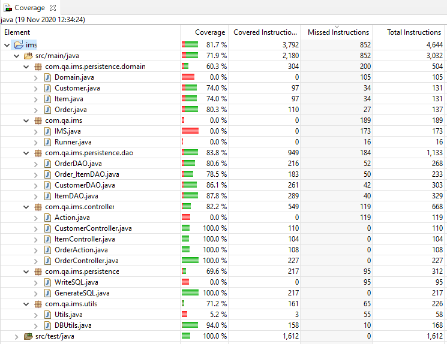

Test Coverage: 80%
# Inventory Management System

This project is an Inventory Management System (IMS) that can be used to create customers, items, and orders. It is controlled via a command line interface. Customers have a first name and a last name. Items have a title and a price. Orders have a customer, and then a number of items associated with them. 
The project works via a series of Data Access Object (DAO) classes, that interact with an SQL database. This is a highly flexible system, as it can be used for effectively any kind of item and customer. 


## Getting Started

These instructions will get you a copy of the project up and running on your local machine for development and testing purposes. See deployment for notes on how to deploy the project on a live system.
1. First fork this projet to your local Github so you cn have your own copy
2. Download all the files needed
3. Ensure that you have Maven installed
4. Ensure that you have a Java Development Environment installed
5. Ensure that you have MySQLWorkbench installed
6. Open the file in your local Java Developemnt Environment


### Prerequisites

What things you need to install the software and how to install them
###### Software to install
1. [Maven version 3.6.3](http://maven.apache.org/download.cgi)

Maven is used to build the final Jar file, as well as providing useful test logs

2. [JDK version 8](https://www.oracle.com/java/technologies/javase/javase-jdk8-downloads.html)

The JDK standing for Java development kit allows Maven to build the final file, as well as being needed to run a development environment. *Note Using a higher version of the JDK will stop the final build from working*

3. Some Java Development Environment, I have used [Eclipse](https://www.eclipse.org/downloads/)

I used eclipse to initially create this project, so I would reccomend that, but any Java Development Environment should feasibly work, **as long as it can use Maven**.


4. [MySQL WorkBench](https://dev.mysql.com/downloads/workbench/5.2.html)


MySQL WorkBench is used to set up the SQL server that the project will communicate with, as well as being useful for testing sql statments before adding them to the java code


### Installation and steup

All of the above are executable installers and can simply be run, however there are some initial setup steps that must be done as well

##### The JDK
To use java properly the file pathway and environment variables need to be set up. This [guide](https://www.baeldung.com/java-home-on-windows-7-8-10-mac-os-x-linux) details how this can be done.

##### Maven
The same process needs to be done with maven to ensure that it can generate the final .jar file. [Guide](https://maven.apache.org/install.html)

##### Add Maven to Eclipse or you IDE
If you are using Eclipse, you may need to add Maven to it, this can be done by following this [guide](http://roufid.com/how-to-install-maven-on-eclipse-ide/).


##### MySQL WorkBench
Once the software has been installed, you will need to create a new database server, with the name "ims".[Guide](https://docs.oracle.com/cd/E17952_01/workbench-en/wb-getting-started-tutorial-create-connection.html)
Once this has been done, open up the connection in workbench by double clicking on it, then run the following code:
```
CREAT SCHEMA ims
```
This creates the databse that the project will look at to get/store data.


##### Opening the project in Eclipse
Open up eclipse, and go to file in the top right hand corner.
Halfway down the file menu, select import, the icon is a little arrow into a tray.
In the file menu that comes up, select Maven, and then Existing Maven Project.
Click next.
Navigate to where you have dowloaded the project, and then it should be finished!

##### Update the SQL generation file
Once piece of code that needs to be changed is the part that logs the sql data.
Navigate to WriteSQL. This is in the package com.qa.ims.persistence, under src/main/java.
There should be a file writer on line 15 that looks like this:
```
public String SQLText() {
		try {
			FileWriter write = new FileWriter("C:\\Users\\andre\\IMS-Starter\\src\\main\\resources\\sql-data.sql\\");
			for(String string:sqlgen.GenerateCustomers()) {
				write.write(string);
			}
```
Change it so that the referenced file is the location on your computer. It should look like this:
```
FileWriter write = new FileWriter("<your_file_pathway>");

```
*Note - You might see that there are a number of backslashes \ in the file path, this is because it is an escape character in java, so we need to preceed a \ with a \ to tell java to use the backslash in the string, and not ignore the next character*

### Using the project
When you click run the project will ask you for your username and password, these are the user name and password that you set for the SQL database.
It will then ask you what object you would like to deal with, like this:
```
Which entity would you like to use?
CUSTOMER: Information about customers
ITEM: Individual Items
ORDER: Purchases of items
STOP: To close the application
```
Type in one of these, for example let's say that we want to add a new customer, which will bring us to this menu:
```
customer
What would you like to do with customer:
CREATE: To save a new entity into the database
READ: To read an entity from the database
UPDATE: To change an entity already in the database
DELETE: To remove an entity from the database
RETURN: To return to domain selection
```
To create a new customer, type in **CREATE**. It will then ask for a first name and surname:
```
create
Please enter a first name
john
Please enter a surname
doe
Customer created
```
This will then take us back to the previous menu. To view all the customers currently in the system, we type in **READ**:
```
read
ID:1 first name:tom surname:smith
ID:2 first name:jordan surname:harrison
ID:3 first name:john surname:doe
```
By default there are two customers in the system, as well as two items and orders.
To delete these, we type in _**DELETE**_ and the ID of the customer we want to delete:
```
delete
Please enter the id of the customer you would like to delete
1
```
This will delete any orders associated with the customer as well. If we delete an item, the associated orders are also deleted as well.
To exit the program, we simply type **RETURN** and then **STOP**, which will exit.
```
What would you like to do with customer:
CREATE: To save a new entity into the database
READ: To read an entity from the database
UPDATE: To change an entity already in the database
DELETE: To remove an entity from the database
RETURN: To return to domain selection
return
Which entity would you like to use?
CUSTOMER: Information about customers
ITEM: Individual Items
ORDER: Purchases of items
STOP: To close the application
stop
SO LONG!
```

## Running the tests

There are a number of automated tests in this system, which ensure that the functionality is working. To run these tests, navigate to src/test/java in the IDE. 
Right click on it, and select run as JUnit test. To get the coverage, select Coverage as JUnit test, it should be as in the image below:



### Unit Tests 

The unit tests are the moslty DAO tests, using JUnit. They test whether the DAOs are giving the expected responses, and working properly. 
For example, to test the reading functionality of the Cusomter DAO:

```
@Test
public void testReadAll() {
	List<Customer> expected = new ArrayList<>();
	expected.add(new Customer(1L, "tom", "smith"));
	expected.add(new Customer(2L, "jordan", "harrison"));
	assertEquals(expected, DAO.readAll());
}
```
Given some dummy test data, this tells JUnit that the expected result is a list of two customers with the above values.
The dummy test data is located in IMS-Starter/src/test/resources/sql-data.sql.


### Integration Tests 
Integration tests test how well the bits of the project fit together, and that they are giving the correct outputs.
These are done using Mockito to create "fake" outputs from functions that have alread been tested to compare with what should be happening.
They are located in the controller tests, and can be run on that. 
For example, to test the customer controller creation function:

```
@Test
public void testCreate() {
	final String F_NAME = "barry", L_NAME = "scott";
	final Customer created = new Customer(F_NAME, L_NAME);

	Mockito.when(utils.getString()).thenReturn(F_NAME, L_NAME);
	Mockito.when(dao.create(created)).thenReturn(created);

	assertEquals(created, controller.create());

	Mockito.verify(utils, Mockito.times(2)).getString();
	Mockito.verify(dao, Mockito.times(1)).create(created);
}
```
This tells JUnit that when it runs utils.getString to return the variables that we have defined above.
It does a similar thing for dao.create() but returns the customer we made.
It then checks that we are getting the correct output, as well as how many times our mocks have run.

## Deployment
### Creating the .jar file
To create the .jar file, navigate to the location of IMS-Starter in your file explorer, and open it
Open windows powershell in this location.

Type "mvn clean package"

This tells maven to create the jar file. It will run the tests, and complie the final file, which could take some time, so be patient!

Once this has completed there will be a new file in you IMS-Starter called target, which will have two .jar files, one with the dependencies, and one without.

To run the .jar file, copy the file pathway of the one with dependencies and enter into the cmd the following:

>java -jar "your-file-pathway"

 This will run the system in the command line.

##Acronyms
* DAO - Database Access Object: A java class that acceses the database
* JDK - Java Development Kit
* IDE - Integrated development environment: Where the actual coding is being done
* CMD - The command line interface


## Built With

* [Eclipse](https://www.eclipse.org/) - Java IDE
* [Maven](https://maven.apache.org/) - Dependency Management
* [MySQLWorkbench](https://www.mysql.com/products/workbench/) - SQL server management

## Versioning

* [Github](https://github.com/) - (How else did you even find this?)


## Authors

* **Andrew Klein** - *Finalisation*  - [andrewklein](https://github.com/andrewklein98)

* **Chris Perrins** - *Initial work* - [christophperrins](https://github.com/christophperrins)

## License

This project is licensed under the MIT license - see the [LICENSE.md](LICENSE.md) file for details 

*For help in [Choosing a license](https://choosealicense.com/)*

## Acknowledgments

* Piers Barber for putting up with all the questions
* Aswene Sivaraj for the same
